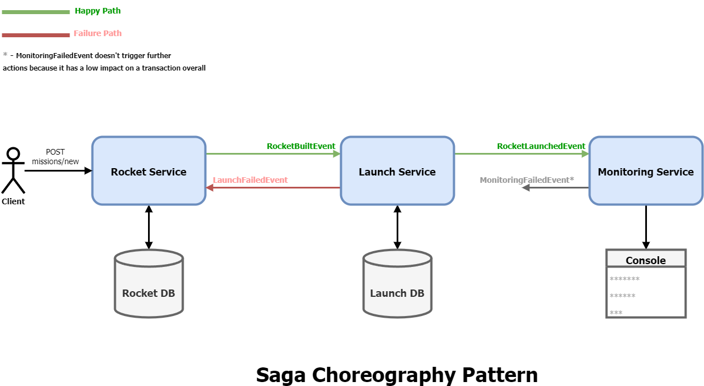
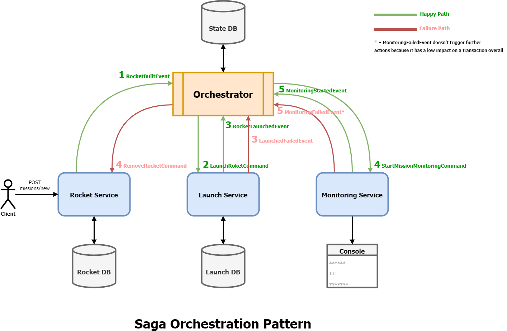

# Saga

This is an implementation of **Saga Choreography** and **Saga Orchestration** patterns using **RabbitMQ** and **MassTransit's State Machine**.

### Main Tools and Technologies
- MassTransit
- RabbitMQ
- SQLite

### Required Infrastructure

- [.NET 7.0 SDK](https://dotnet.microsoft.com/download/dotnet/7.0)
- [Docker](https://docs.docker.com/get-docker)

To start the infrastructure via Docker, type the following command at the solution directory:

```
docker compose up -d
```
# Choreography-based saga


### Usage
Apply the migrations for each of the following projects: `Saga.Choreography.Rockets`, `Saga.Choreography.Launches`, `Saga.Choreography.Monitoring`.  

Run above services.  

Make a `POST` request to the Rockets service `missions/new` endpoint. Example:
```json
{
	"name": "Voyager 1",
	"destination": "Jupiter"
}
```

# Orchestration-based saga


### Usage
Apply the migrations for each of the following projects: `Saga.Orchestration.Rockets`, `Saga.Orchestration.Launches`, `Saga.Orchestration.Monitoring`, `Saga.Orchestration.Orchestrator`.

Run above services.  

Make a `POST` request to the Rockets service `missions/new` endpoint. Example:
```json
{
	"name": "Voyager 2",
	"destination": "Uranus"
}
```